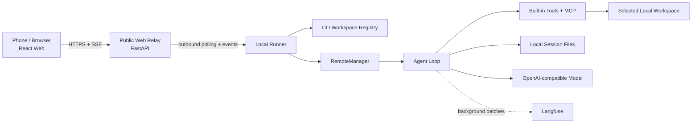

# AutoCode (CoreCoder)

> A local-first, model-agnostic coding agent runtime with CLI, secure Web remote
> control, multimodal input, Git review, MCP tools, resumable sessions, and
> Langfuse observability.

[](https://python.org)
[](LICENSE)
[](pyproject.toml)

[中文](README_CN.md) | English

The repository folder is commonly called **CoreCoder**. The published Python
package, CLI command, and Web product name are currently **AutoCode**.

AutoCode began as a compact reconstruction of the load-bearing ideas behind
Claude Code. It is now a practical local coding-agent system rather than a
single demo loop: the project includes an extensible Agent runtime, persistent
sessions, safety policy, MCP, multimodal input, remote channels, a React Web UI,
Git operations, diagnostics, Langfuse tracing, and an independent evaluation
harness.

## Design Principles

- **Local workspace is the source of truth.** Code, sessions, uploads, tools,
  and commands run on the user's machine.
- **CLI defines available workspaces.** Opening a project with the CLI registers
  it locally. The Web UI can only select already-registered projects; it cannot
  create arbitrary workspace paths.
- **The public server is a relay, not a coding machine.** It authenticates the
  browser, serves the Web UI, queues jobs, and forwards streaming events.
- **The local Runner makes outbound connections.** The development machine does
  not need to expose a filesystem or Agent port to the public internet.
- **Model provider is replaceable.** AutoCode works with OpenAI-compatible
  endpoints and optionally LiteLLM providers.
- **Runtime evidence remains inspectable.** Checkpoints, transcripts, audit
  events, traces, model rounds, and diagnostics are stored in readable local
  files.

## Current Capabilities

### Coding Agent

- Streaming multi-round Agent loop
- OpenAI-compatible tool calling
- Parallel execution for independent tool calls
- Workspace-scoped read, write, edit, delete, glob, and grep tools
- Shell commands and managed background processes
- Todo state and task lifecycle
- Isolated sub-agent context through the built-in `agent` tool
- Three-layer context compaction: tool-result snipping, LLM summarization, and
  hard collapse
- Project rules from `AGENTS.md` and `CLAUDE.md`
- Generated project memory in `.autocode/PROJECT_MEMORY.md`
- Retry and recovery state for failed tool calls

### Multimodal and File Transfer

- Upload up to five files per Web turn
- 10 MB limit per upload and 25 MB total per turn
- PNG, JPEG, WEBP, and non-animated GIF input for vision-capable models
- `read_image` tool for images that already exist in the workspace
- Uploaded files stored under the selected local workspace at
  `.autocode/uploads/`
- `web_send` tool for sending a local workspace file back to the authenticated
  Web conversation
- Image/PDF preview and file download on mobile Web
- 25 MB limit and one-hour lifetime for a Web file offer
- Protected `.git`, `.autocode`, and `.env*` files cannot be sent through
  `web_send`

### Sessions and Diagnostics

- Persistent session and task state
- Session titles derived from the first user message
- `/resume` listing filtered to the current workspace
- Full conversation rendering after CLI resume
- Web session history, resume, deletion with confirmation, and refresh recovery
- Append-only raw transcript
- Structured security and runtime audit journal
- Aggregated per-session trace
- Raw and Markdown model-round records
- Rotating local JSONL diagnostic logs

### Integrations

- Shared stdio MCP runtime with dynamic tool discovery
- Telegram adapter
- Feishu adapter with approval cards and file handling
- Authenticated React Web UI
- Official Langfuse Python SDK integration
- Git status, diff, compare, branch switching/creation, stage/unstage, commit,
  and push from Web
- Diff-line feedback that can be inserted into an Agent prompt

## Architecture



The public Relay never resolves or reads a local workspace. The local Runner
receives an opaque `workspace_id`, resolves it through
`~/.autocode/workspaces.json`, and rejects projects that were not previously
opened by the CLI.

For a detailed request sequence, multimodal flow, state rationale, and latency
stages, see [docs/architecture.md](docs/architecture.md).

## Package Layout

```text
autocode/
├── agent/          # Agent loop and task lifecycle
├── context/        # Prompt, todo, memory, and context compaction
├── infra/          # Workspace filesystem, processes, command runner
├── remote/         # Channel-neutral manager, Feishu, Telegram
├── runtime/        # Tool execution, policy, hooks, recovery
├── state/          # Checkpoint, transcript, audit, trace, model rounds
├── tools/          # Built-in Agent tools
├── web/            # FastAPI Relay, local Runner, files, Git integration
├── attachments.py  # Web upload validation and local persistence
├── cli.py          # Interactive CLI
├── config.py       # Environment and workspace configuration
├── llm.py          # OpenAI-compatible and LiteLLM backends
├── mcp.py          # Shared stdio MCP client/runtime
├── observability.py# Langfuse observations
└── workspaces.py   # CLI-owned workspace registry
frontend/           # React 19 + Vite Web client
eval/               # Local Agent evaluation harness
tests/              # Runtime, state, Web, MCP, policy, and integration tests
deploy/             # Example systemd service for the public Relay
```

## Installation

Install the base CLI:

```bash
python -m pip install -e .
```

Install optional features as needed:

```bash
# Web Relay and local Runner
python -m pip install -e ".[web]"

# Non-OpenAI providers through LiteLLM
python -m pip install -e ".[litellm]"

# Remote chat adapters
python -m pip install -e ".[telegram]"
python -m pip install -e ".[feishu]"

# Tests
python -m pip install -e ".[dev]"
```

Python 3.10 through 3.13 are covered by the CI matrix.

## Model Configuration

AutoCode reads the nearest `.env` while walking from the current directory
toward the user home directory. Existing process environment variables are
used when a value is not present in that `.env`.

Minimal OpenAI-compatible configuration:

```dotenv
AUTOCODE_MODEL=gpt-5
AUTOCODE_API_KEY=your-api-key
AUTOCODE_BASE_URL=https://api.openai.com/v1
```

Common runtime settings:

| Variable | Purpose | Default |
| --- | --- | --- |
| `AUTOCODE_MODEL` | Model name | required |
| `AUTOCODE_API_KEY` | Provider API key | required |
| `AUTOCODE_BASE_URL` | OpenAI-compatible base URL | provider default |
| `AUTOCODE_PROVIDER` | `openai` or `litellm` | `openai` |
| `AUTOCODE_MAX_TOKENS` | Maximum generated tokens | `4096` |
| `AUTOCODE_MAX_CONTEXT` | Context budget used by compaction | `1000000` |
| `AUTOCODE_TEMPERATURE` | Model temperature | `0` |
| `AUTOCODE_WORKSPACE_ROOT` | Workspace opened by the CLI | current directory |
| `AUTOCODE_AUTO_APPROVE` | Auto-approve eligible operations | disabled |
| `AUTOCODE_MCP_CONFIG` | MCP JSON configuration path | none |

LiteLLM example:

```dotenv
AUTOCODE_PROVIDER=litellm
AUTOCODE_MODEL=anthropic/claude-sonnet-4-6
ANTHROPIC_API_KEY=your-api-key
```

The exact model name and provider environment variables are determined by the
configured backend.

## CLI

Start AutoCode inside a project:

```bash
cd path/to/project
autocode
```

This launch registers the resolved project directory in the local workspace
registry. It then becomes selectable in the Web UI.

One-shot mode:

```bash
autocode -p "inspect this project and explain its architecture"
```

Resume a known session at startup:

```bash
autocode --resume session_20260724_180243_9a751701
```

Interactive commands:

```text
/help
/reset
/model [name]
/tokens
/compact
/diff
/resume [session_id]
/task
/todo
/trace
/mcp
/approve
/approve_all
/reject
```

`/resume` lists only sessions whose saved `workspace_root` matches the current
project. Resuming restores the checkpoint and renders the saved user/assistant
conversation before accepting new input.

## MCP

AutoCode currently implements a shared **stdio MCP runtime**. Servers are
started locally, initialized with MCP protocol version `2025-06-18`, and their
tools are injected into the Agent tool registry.

Example configuration:

```json
{
  "mcpServers": {
    "memory": {
      "command": "npx",
      "args": ["-y", "@modelcontextprotocol/server-memory"],
      "env": {
        "MEMORY_FILE_PATH": "data/mcp-memory.jsonl"
      }
    }
  }
}
```

Then configure:

```dotenv
AUTOCODE_MCP_CONFIG=/absolute/path/to/mcp.json
```

Use `/mcp` to inspect server status and loaded tools. MCP calls are evaluated by
the same runtime policy and require confirmation by default.

Current MCP limitations:

- stdio transport only
- no interactive elicitation/input-required flow
- no native Skills or plugin package framework

## Secure Web Remote Control

The Web system has two independent processes:

1. **Public Relay** — serves the React application, authenticates requests,
   queues jobs, and forwards SSE events.
2. **Local Runner** — polls the Relay over HTTPS and performs all workspace,
   Agent, model, file, and Git operations locally.

### 1. Start the Relay

Generate two different random tokens of at least 24 characters:

```dotenv
AUTOCODE_WEB_TOKEN=browser-access-token
AUTOCODE_RUNNER_TOKEN=local-runner-token
AUTOCODE_WEB_HOST=0.0.0.0
AUTOCODE_WEB_PORT=8765
AUTOCODE_WEB_SSL_CERTFILE=/path/to/server.crt
AUTOCODE_WEB_SSL_KEYFILE=/path/to/server.key
```

Run:

```bash
autocode-web
```

The repository includes
[deploy/corecoder-web.service](deploy/corecoder-web.service) as a hardened
systemd service example.

### 2. Start the Local Runner

Create `~/.autocode/web-runner.env`:

```dotenv
AUTOCODE_RELAY_URL=https://your-relay.example:8765
AUTOCODE_RUNNER_TOKEN=local-runner-token
AUTOCODE_RELAY_CA_CERT=/absolute/path/to/relay-ca-or-certificate.pem
AUTOCODE_RUNNER_POLL_WAIT=25
```

The Runner requires an HTTPS Relay URL and an existing CA/certificate file.
Model credentials remain in the local project/environment configuration.

Run:

```bash
autocode-web-runner
```

Open the Relay URL and enter `AUTOCODE_WEB_TOKEN`. The browser token and Runner
token must be different.

### Streaming Stages

The Web path exposes these main stages:

```text
claimed
→ runner_started
→ model_started
→ first_token
→ last_token
→ persisted
→ runner_completed
```

These stages separate public queue delay, local Runner delay, model latency,
streaming time, and persistence time.

### Web Git Workspace

For a CLI-registered Git workspace, Web supports:

- working-tree and staged changes
- additions/deletions and per-file diff
- untracked text-file previews
- compare against a validated local or remote base
- local and remote branch listing
- switch existing local branch
- create branch
- stage and unstage selected files
- commit staged changes
- push the current named branch
- send selected diff lines into the chat prompt for review

Git commands are executed directly as argument arrays, not through a shell, and
paths/refs are validated against the selected repository.

## Feishu and Telegram

Install the matching optional dependency, configure credentials, and run the
adapter command:

```bash
autocode-feishu
autocode-telegram
```

Relevant configuration:

```dotenv
# Feishu
AUTOCODE_FEISHU_APP_ID=...
AUTOCODE_FEISHU_APP_SECRET=...
AUTOCODE_FEISHU_ALLOWED_OPEN_IDS=...
AUTOCODE_FEISHU_ALLOWED_CHAT_IDS=...

# Telegram
AUTOCODE_TELEGRAM_BOT_TOKEN=...
AUTOCODE_TELEGRAM_ALLOWED_CHATS=123456789
```

Allow lists should be configured before exposing a tool-enabled Agent through a
chat channel.

## Langfuse and Local Observability

Configure the official Langfuse Python SDK:

```dotenv
LANGFUSE_PUBLIC_KEY=pk-lf-...
LANGFUSE_SECRET_KEY=sk-lf-...
LANGFUSE_BASE_URL=https://cloud.langfuse.com
```

The observation hierarchy is:

```text
agent turn
├── generation
├── tool
├── tool
└── generation
```

AutoCode records the session ID, task metadata, model, model parameters, token
usage, model input/output, tool arguments/results, status, and errors. The SDK
batches delivery in the background; normal Web responses do not wait for
`flush()`.

Langfuse is optional. Without credentials, local checkpoints, transcripts,
audit events, traces, model rounds, and diagnostic logs continue to work.

Local process diagnostics default to:

```text
~/.autocode/logs/<component>.jsonl
```

Each diagnostic logger rotates at 5 MB and keeps five backups. Override the
directory with `AUTOCODE_LOG_DIR` and the level with `AUTOCODE_LOG_LEVEL`.

## Session Storage: Files or a Database?

AutoCode currently uses files and does **not** require a database:

```text
~/.autocode/sessions/<session_id>/
├── checkpoint.json
├── session.json
├── current_task.json
├── transcript.jsonl
├── audit.jsonl
├── trace.json
├── llm_rounds.jsonl
└── llm_rounds.md
```

| File | Role |
| --- | --- |
| `checkpoint.json` | Mutable recovery snapshot: messages, model, workspace, task |
| `session.json` | Small session index record for humans and integrations |
| `current_task.json` | Current task state and pending approval |
| `transcript.jsonl` | Append-only raw messages and compaction events |
| `audit.jsonl` | Append-only lifecycle, policy, tool, approval, and error events |
| `trace.json` | Derived per-session counters, token totals, tools, files, duration |
| `llm_rounds.jsonl` | Raw model request/response rounds and usage |
| `llm_rounds.md` | Human-readable rendering of model rounds |

### Why files are the better fit today

- The runtime is local and normally has one owner.
- A session is naturally isolated in one directory.
- JSONL provides simple append-only evidence for debugging and audit.
- Checkpoints are portable, inspectable, and easy to back up.
- Resume does not depend on a database service or migration state.
- The current session count and query patterns do not justify another storage
  dependency.

### When a database becomes worthwhile

A **local SQLite index** becomes useful when AutoCode needs thousands of
sessions, full-text search, fast pagination, retention jobs, cross-workspace
analytics, or multiple local writers. In that design, transcript/audit JSONL
should remain the durable evidence source while SQLite stores rebuildable
metadata and search indexes.

PostgreSQL or another server database is only justified if the product becomes
a multi-user, centralized control plane. Moving current session truth to the
public Relay would violate the local-workspace architecture and is not the
current design.

Langfuse storage is separate: it belongs to the observability service and does
not replace local recovery or audit files.

## Safety Model

The runtime currently provides application-level controls:

- file tools resolve paths against the selected workspace
- `.env` and `.git` mutations are protected
- shell deletion commands are denied; deletion uses a dedicated confirmed tool
- destructive Git reset/clean and process-kill shell commands are denied
- streaming commands are directed to managed process tools
- MCP calls require confirmation by default
- pending approvals are persisted in the session checkpoint
- Web, Runner, and channel identities are allow-listed/authenticated

Important limitation: `autocode.infra.Sandbox` is a workspace-scoped command
runner with a filtered environment and timeout. It is **not** an OS-level
filesystem/network sandbox. Use a dedicated OS user, container, VM, or another
external isolation boundary for untrusted repositories or models.

The Relay queue is currently in memory. A Relay restart can discard an
in-flight Web job, while the local session checkpoint and workspace changes
already persisted by the Runner remain on the local machine.

## Evaluation and Tests

Run the main test suite:

```bash
python -m pytest tests/ -q
```

Compile the package:

```bash
python -m compileall -q autocode tests
```

The independent local evaluation harness under `eval/` measures:

- final outcome
- trajectory
- safety
- recovery
- efficiency
- optional LLM-judge quality

Examples:

```bash
python -m eval.runner --list
python -m eval.runner --task debug-billing-settlement-03
python -m eval.runner --trials 3 --disable-llm-judge
```

Evaluation artifacts are written under `eval/runs/<timestamp>/`. See
[eval/README.md](eval/README.md) for the task schema and report layout.

## Known Product Boundaries

AutoCode currently does not provide:

- OS-enforced filesystem/network sandboxing
- a native Skills/plugin marketplace
- HTTP/SSE MCP transports
- durable Relay job storage
- multi-tenant authorization
- cloud-hosted workspace execution

These boundaries are intentional documentation of the current code, not claims
about future behavior.

## License

[MIT](LICENSE)
