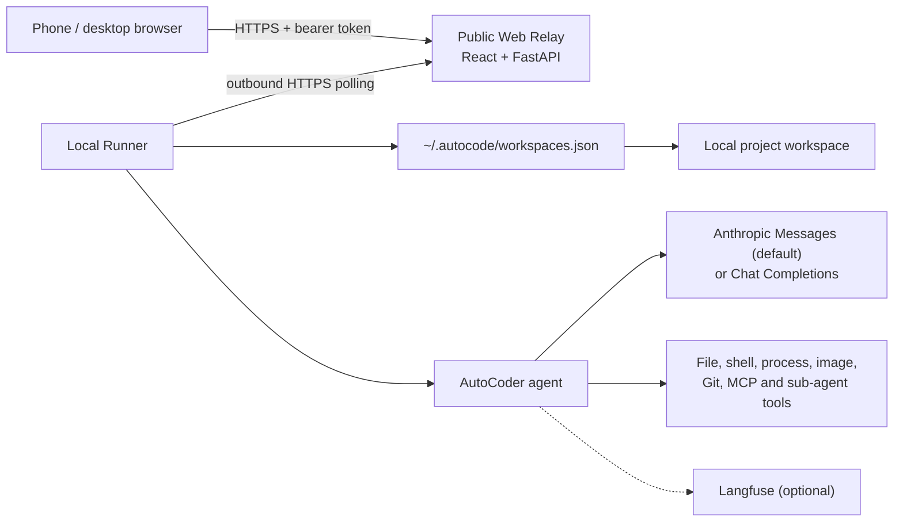

# AutoCoder

[中文说明](README_CN.md)

AutoCoder is a local-first, multimodal coding agent. Its Python package and
command-line program are currently named `autocode`.

The agent works inside a project on your own computer. The optional Web Relay
lets you use that same local workspace from a phone without copying the
repository to the public server. A local Runner connects outward to the Relay,
executes the agent locally, and streams tokens and tool events back to the
browser.

## Architecture



The public Relay contains the Web UI, authentication, an in-memory job queue,
and SSE forwarding. It cannot open local project files by itself. Workspaces
are registered by the CLI and stored in `~/.autocode/workspaces.json`; the Web
UI can only select a workspace that is already registered and still exists.

## Features

- Interactive and one-shot coding-agent CLI.
- Native Anthropic Messages API by default, with OpenAI-compatible Chat
  Completions and optional LiteLLM support.
- Workspace-scoped file, search, shell, background-process, image, task-list,
  and sub-agent tools.
- MCP stdio servers exposed to the agent as regular tools.
- Checkpointed sessions with a shared title and history in CLI and Web.
- Edit and rerun the latest completed prompt without rolling back workspace files.
- Steer an active turn or queue FIFO follow-ups from both the CLI and Web.
- Validated per-turn ChangeSets for safe Undo/Reapply with conflict detection.
- Multimodal Web input: text, files, and PNG/JPEG/GIF/WebP images.
- Secure phone access through a public Relay and an outbound-only local Runner.
- SSE token streaming with execution-stage timings.
- Temporary download links for files inside the active workspace.
- Git status, diff review, branch switching/creation, stage/unstage, commit, and
  push from the Web interface.
- Optional Langfuse traces for agent turns, model generations, and tool calls.
- Optional Feishu and Telegram entry points.
- Local evaluation harness and pytest test suite.

## Requirements

- Python 3.10 or newer.
- A model name, API key, and Anthropic Messages or Chat Completions endpoint.
- Git for the Web Git panel.
- Node.js and npm only when rebuilding the React frontend.
- HTTPS and a trusted CA certificate when a local Runner connects to a remote
  Relay.

## Installation

Windows PowerShell:

```powershell
python -m venv .venv
.\.venv\Scripts\Activate.ps1
python -m pip install -e ".[web,dev]"
```

Linux or macOS:

```bash
python -m venv .venv
source .venv/bin/activate
python -m pip install -e ".[web,dev]"
```

Install only the optional integrations you need:

```bash
python -m pip install -e ".[litellm]"
python -m pip install -e ".[telegram]"
python -m pip install -e ".[feishu]"
```

## Model configuration

AutoCoder reads the nearest `.env` file from the current directory upward.
Create one in the project from which you will run the agent:

```dotenv
AUTOCODE_MODEL=macaron-v1-coding-venti
AUTOCODE_API_KEY=your-api-key
AUTOCODE_BASE_URL=https://mintcn.macaron.xin

# Optional
AUTOCODE_PROVIDER=anthropic
AUTOCODE_MAX_TOKENS=32000
AUTOCODE_TEMPERATURE=0
AUTOCODE_MAX_CONTEXT=1000000
```

`AUTOCODE_MAX_TOKENS` is the model's output budget. AutoCode reserves that
budget from `AUTOCODE_MAX_CONTEXT` before calculating automatic context
compression thresholds, so `AUTOCODE_MAX_CONTEXT` must be larger.

`AUTOCODE_PROVIDER=anthropic` (the default) uses `/v1/messages`, including
native image blocks inside tool results. Set `AUTOCODE_PROVIDER=openai` to keep
using an OpenAI-compatible `/chat/completions` endpoint, or `litellm` for the
optional LiteLLM adapter. Provider base URLs must be the root expected by the
corresponding official SDK; for Anthropic-compatible gateways, do not append
`/v1/messages` yourself.

## CLI

Start an interactive session from a project directory:

```bash
cd path/to/project
autocode
```

This command also registers that directory as a Web-selectable workspace.

Run one task and exit:

```bash
autocode -p "Explain the architecture and identify the highest-risk module."
```

Resume a session:

```bash
autocode --resume SESSION_ID
```

Important interactive commands include `/help`, `/reset`, `/model`, `/tokens`,
`/compact`, `/diff`, `/resume`, `/turn`, `/todo`, `/trace`, `/mcp`,
`/approve`, `/approve_scope`, `/permissions ask|full_access`, and `/reject`.

## Web access from a phone

The Web design has two processes:

1. `autocode-web` runs on the public server and serves the React UI and Relay.
2. `autocode-web-runner` runs on the computer that owns the workspace.

The Runner makes an outbound HTTPS connection, so the development computer
does not need to expose an inbound port.

### 1. Build the frontend

The built assets are written to `autocode/web/static`.

```bash
cd frontend
npm ci
npm run check
npm run build
```

### 2. Start the public Relay

Provide two different random tokens of at least 24 characters:

```dotenv
AUTOCODE_WEB_TOKEN=browser-access-token-at-least-24-characters
AUTOCODE_RUNNER_TOKEN=runner-access-token-at-least-24-characters
AUTOCODE_WEB_HOST=0.0.0.0
AUTOCODE_WEB_PORT=8765
AUTOCODE_WEB_SSL_CERTFILE=/path/to/fullchain.pem
AUTOCODE_WEB_SSL_KEYFILE=/path/to/private-key.pem
```

Then run:

```bash
autocode-web
```

The repository also contains `deploy/corecoder-web.service` as a systemd
service example. Keep the Relay behind HTTPS and do not reuse the browser token
as the Runner token.

The development Relay uses a versioned wheel release directory rather than a
Git checkout. See the [development deployment runbook](docs/development-deployment.md)
before updating that server.

### 3. Start the local Runner

The default Runner configuration file is
`~/.autocode/web-runner.env`. It can be overridden with
`AUTOCODE_RUNNER_ENV_FILE`.

```dotenv
AUTOCODE_RELAY_URL=https://your-relay.example.com
AUTOCODE_RUNNER_TOKEN=runner-access-token-at-least-24-characters
AUTOCODE_RELAY_CA_CERT=C:/path/to/trusted-relay-ca.pem

AUTOCODE_MODEL=gpt-5
AUTOCODE_API_KEY=your-api-key
AUTOCODE_BASE_URL=https://api.openai.com/v1
AUTOCODE_PROVIDER=openai
```

Start it on the workspace-owning computer:

```bash
autocode-web-runner
```

Before using a project in the browser, run `autocode` once from that project
directory so the CLI registers it.

### Upload and download limits

- At most 5 attachments per request.
- At most 10 MiB per uploaded attachment.
- At most 25 MiB total uploaded data per request.
- Images accepted by the multimodal path: GIF, JPEG, PNG, and WebP.
- A file offered by the agent for Web download must be inside the active
  workspace and no larger than 25 MiB.
- `.git`, `.autocode`, and `.env*` paths cannot be sent through the Web download
  tool.
- Download offers are short lived and are held by the local Runner.

## Langfuse observability

Set the official Langfuse SDK credentials in the agent runtime environment:

```dotenv
LANGFUSE_PUBLIC_KEY=pk-lf-...
LANGFUSE_SECRET_KEY=sk-lf-...
LANGFUSE_BASE_URL=https://cloud.langfuse.com
```

When configured, AutoCoder records the agent turn, model generation, and tool
observations with their parent-child relationship, latency, and token usage.
The SDK sends observations in background batches. Langfuse is for
observability, not session recovery; local session files remain the source used
to restore a conversation.

## MCP

Point `AUTOCODE_MCP_CONFIG` to a JSON file containing stdio servers:

```json
{
  "mcpServers": {
    "example": {
      "command": "example-mcp-server",
      "args": ["--stdio"],
      "env": {}
    }
  }
}
```

MCP tools require policy approval before execution. MCP tools that require
additional interactive input are not currently supported.

## Local data

AutoCoder does not currently require a database. Its local state is stored
under `~/.autocode`:

```text
~/.autocode/
├── workspaces.json
├── logs/
└── sessions/
    ├── projects/
    │   └── G--mycode-AutoCoder/
    │       ├── project.json
    │       └── sessions/
    │           └── <session_id>/
    │               ├── checkpoint.json
    │               ├── session.json
    │               ├── current_turn.json
    │               ├── transcript.jsonl
    │               ├── audit.jsonl
    │               └── trace.json
    └── .session-locations/
        └── <session_id>.json
```

- `projects/<readable-workspace-path>/` physically isolates full sessions by
  normalized workspace. For example, `G:/mycode/AutoCoder` is stored under
  `G--mycode-AutoCoder/`; a short hash is added only if two expanded names collide.
- `.session-locations/` stores only the location pointer used to resume by `session_id`.
- `checkpoint.json` stores recoverable agent state.
- `session.json` stores session summary metadata.
- `transcript.jsonl` is the complete ordered conversation record.
- `audit.jsonl` records approvals, denials, and security-relevant actions.
- `trace.json` stores the local execution trace shown by diagnostics.
- `~/.autocode/logs/*.jsonl` contains rotating runtime diagnostics.

Web uploads are written below `<workspace>/.autocode/uploads/` and ignored by
the workspace-local `.autocode/.gitignore`.

## Safety boundary

The policy layer exposes Ask for approval and Full access modes. Ask mode
confirms deletion, external web access, and MCP calls, and can grant a
turn-scoped permission for matching hosts or tools. Full access skips those
confirmations. Both modes still keep paths inside the workspace, protect
`.env` and `.git`, and hard-deny destructive shell commands such as `rm -rf`
and `git reset --hard`.

The class currently named `Sandbox` is **not an operating-system sandbox**. It
sets the working directory, filters environment variables, applies a timeout,
and truncates command output, but the spawned process still has the operating
system permissions of the user running AutoCoder. Use a container, VM, WSL
isolation, or a dedicated low-privilege account for untrusted repositories or
models.

## Development and verification

```bash
python -m pytest -q
python -m eval.runner --list

cd frontend
npm run check
npm run build
```

Main directories:

```text
autocode/
├── agent/       # agent loop and orchestration
├── context/     # context and compaction
├── infra/       # command execution
├── remote/      # Feishu, Telegram and shared remote manager
├── runtime/     # policy and runtime coordination
├── state/       # sessions, checkpoints, transcript, audit and trace
├── tools/       # built-in tools
└── web/         # FastAPI Relay, local Runner and built frontend
frontend/        # React + Vite source
deploy/          # deployment examples
docs/            # architecture documentation
eval/            # evaluation harness and tasks
tests/           # automated tests
```

## License

[MIT](LICENSE)
