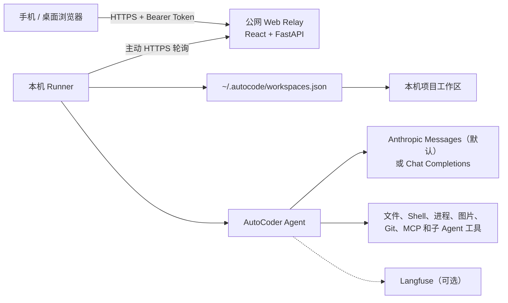

# AutoCoder

[English](README.md)

AutoCoder 是一个本地优先、支持多模态输入的代码 Agent。当前 Python
包名和命令行程序名仍然是 `autocode`。

Agent 在用户自己的电脑和真实项目目录中运行。可选的 Web Relay
让用户能从手机访问同一个本地工作区，而不需要把代码仓库复制到公网服务器。
本机 Runner 主动连接 Relay，在本机执行 Agent，再把 Token 和工具事件流式传回浏览器。

## 架构



公网 Relay 只包含 Web UI、身份验证、内存任务队列和 SSE 转发，本身不能读取本机项目文件。
工作区由 CLI 注册到 `~/.autocode/workspaces.json`；Web 端只能选择已经注册且仍然存在的工作区，
不能在浏览器里随意添加新目录。

## 主要能力

- 支持交互式和单次任务的代码 Agent CLI。
- 默认使用原生 Anthropic Messages API，同时保留 OpenAI 兼容 Chat
  Completions，并可选接入 LiteLLM。
- 工作区范围内的文件、搜索、Shell、后台进程、图片、任务列表和子 Agent 工具。
- 将 MCP stdio Server 的能力作为普通 Agent 工具使用。
- 支持检查点恢复，CLI 和 Web 共用会话标题与历史记录。
- 支持编辑最后一次已完成的提问并重新回答；对话 Revision 与工作区文件状态相互独立。
- 回答运行中可发送 Steer 引导或 FIFO 排队下一条提问，CLI 和 Web 使用同一 Turn 控制语义。
- 每个 Turn 保存可校验的 ChangeSet，可安全 Undo/Reapply；文件发生后续修改时整轮拒绝覆盖。
- Web 多模态输入：文字、文件，以及 PNG/JPEG/GIF/WebP 图片。
- 通过公网 Relay 和仅主动出站连接的本机 Runner 实现手机访问。
- SSE Token 流式输出和分阶段耗时。
- 将当前工作区内的本机文件临时发送到手机预览或下载。
- Web 端查看 Git 状态和 Diff，切换/创建分支，暂存/取消暂存、提交和推送。
- 可选的 Langfuse Agent、模型 Generation 和工具调用观测。
- 可选的飞书和 Telegram 入口。
- 本地评测框架和 pytest 测试套件。

## 环境要求

- Python 3.10 或更高版本。
- 模型名称、API Key，以及 Anthropic Messages 或 Chat Completions API 地址。
- Web Git 面板需要本机已安装 Git。
- 只有重新构建 React 前端时才需要 Node.js 和 npm。
- 本机 Runner 连接远程 Relay 时必须使用 HTTPS，并提供可信 CA 证书。

## 安装

Windows PowerShell：

```powershell
python -m venv .venv
.\.venv\Scripts\Activate.ps1
python -m pip install -e ".[web,dev]"
```

Linux 或 macOS：

```bash
python -m venv .venv
source .venv/bin/activate
python -m pip install -e ".[web,dev]"
```

按需安装其他集成：

```bash
python -m pip install -e ".[litellm]"
python -m pip install -e ".[telegram]"
python -m pip install -e ".[feishu]"
```

## 模型配置

AutoCoder 会从当前目录开始向上查找最近的 `.env`。可以在启动 Agent
的项目中创建：

```dotenv
AUTOCODE_MODEL=macaron-v1-coding-venti
AUTOCODE_API_KEY=your-api-key
AUTOCODE_BASE_URL=https://mintcn.macaron.xin

# 可选
AUTOCODE_PROVIDER=anthropic
AUTOCODE_MAX_TOKENS=32000
AUTOCODE_TEMPERATURE=0
AUTOCODE_MAX_CONTEXT=1000000
```

`AUTOCODE_MAX_TOKENS` 是模型的输出预算。AutoCode 会先从
`AUTOCODE_MAX_CONTEXT` 中预留这部分空间，再计算自动上下文压缩阈值，因此
`AUTOCODE_MAX_CONTEXT` 必须大于输出预算。

`AUTOCODE_PROVIDER=anthropic` 是默认值，使用 `/v1/messages`，工具图片会
直接放进对应的 `tool_result`。设置 `AUTOCODE_PROVIDER=openai` 可继续使用
OpenAI 兼容的 `/chat/completions`；设置为 `litellm` 则启用可选 LiteLLM
适配器。Anthropic 兼容网关的 `AUTOCODE_BASE_URL` 应填写 SDK 使用的根地址，
不要手动追加 `/v1/messages`。

## CLI 使用

在项目目录中启动交互式会话：

```bash
cd path/to/project
autocode
```

这条命令也会把当前目录注册成 Web 端可以选择的工作区。

执行单次任务后退出：

```bash
autocode -p "解释这个项目的架构，并指出风险最高的模块。"
```

恢复历史会话：

```bash
autocode --resume SESSION_ID
```

主要交互命令包括 `/help`、`/reset`、`/model`、`/tokens`、`/compact`、
`/diff`、`/resume`、`/task`、`/todo`、`/trace`、`/mcp`、`/approve`、
`/approve_scope`、`/permissions ask|full_access` 和 `/reject`。

## 从手机访问 Web

Web 架构由两个进程组成：

1. `autocode-web` 运行在公网服务器，提供 React 页面和 Relay。
2. `autocode-web-runner` 运行在拥有真实工作区的电脑上。

Runner 主动发起 HTTPS 连接，因此开发电脑不需要暴露入站端口。

### 1. 构建前端

构建产物写入 `autocode/web/static`：

```bash
cd frontend
npm ci
npm run check
npm run build
```

### 2. 启动公网 Relay

配置两个不同且至少 24 个字符的随机 Token：

```dotenv
AUTOCODE_WEB_TOKEN=browser-access-token-at-least-24-characters
AUTOCODE_RUNNER_TOKEN=runner-access-token-at-least-24-characters
AUTOCODE_WEB_HOST=0.0.0.0
AUTOCODE_WEB_PORT=8765
AUTOCODE_WEB_SSL_CERTFILE=/path/to/fullchain.pem
AUTOCODE_WEB_SSL_KEYFILE=/path/to/private-key.pem
```

启动：

```bash
autocode-web
```

仓库中的 `deploy/corecoder-web.service` 是 systemd 服务示例。Relay
必须通过 HTTPS 对外提供服务，并且浏览器 Token 和 Runner Token 不能相同。

### 3. 启动本机 Runner

Runner 默认读取 `~/.autocode/web-runner.env`，也可以通过
`AUTOCODE_RUNNER_ENV_FILE` 指定其他文件：

```dotenv
AUTOCODE_RELAY_URL=https://your-relay.example.com
AUTOCODE_RUNNER_TOKEN=runner-access-token-at-least-24-characters
AUTOCODE_RELAY_CA_CERT=C:/path/to/trusted-relay-ca.pem

AUTOCODE_MODEL=gpt-5
AUTOCODE_API_KEY=your-api-key
AUTOCODE_BASE_URL=https://api.openai.com/v1
AUTOCODE_PROVIDER=openai
```

在拥有工作区的电脑上启动：

```bash
autocode-web-runner
```

在浏览器使用某个项目之前，需要先在该项目目录运行一次 `autocode`，由 CLI
完成工作区注册。

### 上传与下载限制

- 每次请求最多上传 5 个附件。
- 每个上传附件最大 10 MiB。
- 单次请求的上传数据总计最大 25 MiB。
- 多模态图片支持 GIF、JPEG、PNG 和 WebP。
- Agent 发送到 Web 的文件必须位于当前工作区内，且不超过 25 MiB。
- `.git`、`.autocode` 和 `.env*` 路径不能通过 Web 下载工具发送。
- 文件下载凭据是短期的，并只保存在本机 Runner 中。

## Langfuse 可观测性

在 Agent 的运行环境中配置 Langfuse 官方 SDK 凭据：

```dotenv
LANGFUSE_PUBLIC_KEY=pk-lf-...
LANGFUSE_SECRET_KEY=sk-lf-...
LANGFUSE_BASE_URL=https://cloud.langfuse.com
```

启用后，AutoCoder 会记录 Agent Turn、模型 Generation 和工具 Observation
之间的父子关系、耗时和 Token 用量。SDK 会在后台批量发送观测数据。
Langfuse 负责可观测性，不负责恢复会话；恢复对话仍以本地会话文件为准。

## MCP

通过 `AUTOCODE_MCP_CONFIG` 指定一个包含 stdio Server 的 JSON 文件：

```json
{
  "mcpServers": {
    "example": {
      "command": "example-mcp-server",
      "args": ["--stdio"],
      "env": {}
    }
  }
}
```

执行 MCP 工具前需要经过策略审批。目前不支持需要追加交互输入的 MCP 工具。

## 本地数据

AutoCoder 当前不依赖数据库，本地状态保存在 `~/.autocode`：

```text
~/.autocode/
├── workspaces.json
├── logs/
└── sessions/
    ├── projects/
    │   └── G--mycode-AutoCoder/
    │       ├── project.json
    │       └── sessions/
    │           └── <session_id>/
    │               ├── checkpoint.json
    │               ├── session.json
    │               ├── current_task.json
    │               ├── transcript.jsonl
    │               ├── audit.jsonl
    │               └── trace.json
    └── .session-locations/
        └── <session_id>.json
```

- `projects/<可读项目路径>/`：按规范化 workspace 路径物理隔离完整会话，例如
  `G:/mycode/AutoCoder` 保存到 `G--mycode-AutoCoder/`；仅在名称冲突时追加短哈希。
- `.session-locations/`：只保存通过 `session_id` 恢复会话的位置指针。
- `checkpoint.json`：用于恢复 Agent 的当前状态。
- `session.json`：会话摘要和元数据。
- `transcript.jsonl`：按顺序保存的完整对话记录。
- `audit.jsonl`：审批、拒绝和安全相关操作。
- `trace.json`：供本地诊断查看的执行链路。
- `~/.autocode/logs/*.jsonl`：轮转的运行诊断日志。

Web 上传文件保存在 `<workspace>/.autocode/uploads/`，并由工作区内的
`.autocode/.gitignore` 忽略。

## 安全边界

策略层提供“请求批准”和“完全访问”两种用户可见权限。“请求批准”会确认
删除、外部网页和 MCP 等风险操作，并可按当前任务内的目标站点或工具范围
一次授权同类请求；“完全访问”会跳过这些确认。两种模式都继续限制路径在
当前工作区内，保护 `.env` 和 `.git`，并拒绝 `rm -rf`、`git reset --hard`
等不可绕过的破坏性 Shell 命令。

当前名为 `Sandbox` 的类**不是操作系统级沙箱**。它只负责设置工作目录、
过滤环境变量、限制执行时间和截断命令输出；子进程仍然拥有启动 AutoCoder
的系统用户权限。处理不可信仓库或模型时，应使用容器、虚拟机、WSL 隔离环境
或专门的低权限账号。

## 开发与验证

```bash
python -m pytest -q
python -m eval.runner --list

cd frontend
npm run check
npm run build
```

主要目录：

```text
autocode/
├── agent/       # Agent 循环与编排
├── context/     # 上下文和压缩
├── infra/       # 命令执行
├── remote/      # 飞书、Telegram 和远程会话管理
├── runtime/     # 策略与运行时协调
├── state/       # 会话、检查点、对话、审计和 Trace
├── tools/       # 内置工具
└── web/         # FastAPI Relay、本机 Runner 和构建后的前端
frontend/        # React + Vite 源码
deploy/          # 部署示例
docs/            # 架构文档
eval/            # 评测框架与任务
tests/           # 自动化测试
```

## 开发机部署

开发机 Relay 使用版本化 wheel 发布目录，不是 Git 工作树。更新服务器前请先
阅读[开发机部署手册](docs/development-deployment.md)，不要在
`/home/dev/corecoder-web` 中执行 `git pull`。

## 开源协议

[MIT](LICENSE)
