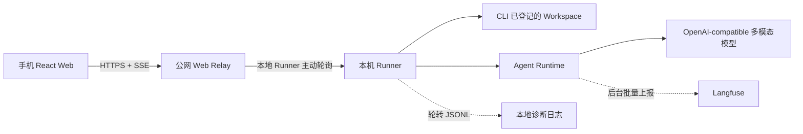

# CoreCoder 架构说明

## 1. 系统边界

CoreCoder Web 不是把本地项目复制到服务器执行。系统分成两个边界：

- 公网 Web Relay：托管 React 页面、鉴权、任务队列和 SSE 事件转发，不读取本地工作区。
- 本地 Runner：主动向 Relay 领取任务，在用户电脑上解析工作区、保存上传文件、运行 Agent 和调用模型。

工作区的事实来源是本机 `~/.autocode/workspaces.json`。CLI 打开项目时调用
`WorkspaceRegistry.register()`；Web 只能读取这些已有项目，并通过 `workspace_id`
选择，不能从浏览器新增任意路径。

因此，服务器只暴露 Web 控制面；代码、会话文件、上传文件和工具执行仍留在本机。
本机 Runner 离线时，Web 不能执行任务。

## 2. 一次 Web 请求的真实链路

1. React 读取文件并编码为 Base64，调用 `POST /api/chat/stream`。
2. Relay 创建任务并向浏览器发送 `claimed` 等 SSE 阶段事件。
3. 本地 Runner 通过 `GET /api/runner/next` 领取任务。
4. Runner 用 `workspace_id` 调用 `WorkspaceRegistry.resolve()`，只允许 CLI 已登记且仍存在的目录。
5. `prepare_attachments()` 把附件写入所选项目的
   `.autocode/uploads/<client>/<batch>/`；该目录自动加入 `.autocode/.gitignore`。
6. 图片同时转换为 Chat Completions 兼容的 `image_url` Data URL，直接进入用户消息；
   普通文件把本地相对路径告诉 Agent，由 `read_file` 读取。
7. `RemoteManager` 驱动 Agent 循环。模型还可以调用 `read_image`，把工作区已有的
   PNG、JPEG、WEBP 或 GIF 作为视觉内容送回下一轮模型。
8. 首 Token、后续 Token、工具开始/结束和持久化等事件从 Runner 回传 Relay，
   再由 SSE 实时推送到手机。
9. Agent turn 和每次 LLM generation 由官方 Langfuse Python SDK 在后台批量上报；
   用户响应不等待 `flush()`。

## 3. Agent 多模态与 Langfuse 多模态

这两种能力互相独立：

- Agent 多模态决定模型能否看到图片。入口有两条：
  Web 上传图片直接进入当前用户消息；`read_image` 工具读取工作区中的已有图片，
  再把视觉内容加入下一轮模型消息。
- Langfuse 多模态只负责观测。它记录 Agent turn、LLM generation、输入、输出、
  Token 用量、首 Token 时间和 session。Base64 Data URL 由 Langfuse SDK 在后台
  提取为媒体对象。

未配置 Langfuse 时，Agent 多模态仍可使用；模型本身不支持视觉时，Langfuse 也不会
让模型获得视觉能力。当前配置不做输入、输出或图片脱敏，完整内容会发送给 Langfuse。

## 4. 状态与日志取舍

会话状态默认位于 `~/.autocode/sessions/<session_id>/`。

| 文件 | 当前用途 | 决策 |
| --- | --- | --- |
| `checkpoint.json` | 保存当前消息、模型和任务状态，供 `/resume` 恢复 | 必须保留，是恢复快照 |
| `transcript.jsonl` | 追加原始消息和压缩事件，保留不可变历史 | 保留，是 checkpoint 损坏后的恢复与审计依据 |
| `audit.jsonl` | 记录工具、审批、阻止和错误等运行事件 | 保留，负责安全与行为审计 |
| `trace.json` | 从运行事件聚合任务状态、工具数、Token 和耗时，供 `/trace` 直接读取 | 暂时保留；它是可派生缓存，未来可由 audit 动态生成 |
| `llm_rounds.jsonl` | 保存每轮模型请求、响应与用量 | 保留但应配置保留周期，便于离线复现模型问题 |
| `llm_rounds.md` | 从 JSONL 生成的人类可读版本 | 可删除并按需生成，不应作为事实来源 |

进程级诊断日志写入 `~/.autocode/logs/*.jsonl`，采用 5 MB、5 个备份的轮转策略。
它记录 Relay/Runner/Langfuse 初始化、网络故障和分段耗时，不替代会话级
transcript、audit 或 trace。

当前不需要数据库：JSON/JSONL 已满足单机执行、恢复和顺序追加。只有在需要跨机器
统一检索、大量会话分页、多人并发或长期统计时，才值得增加 SQLite/PostgreSQL；
Langfuse 自身的数据存储由 Langfuse 服务负责，不应再复制一套到 CoreCoder。

## 5. 延迟观测

SSE 暴露以下关键阶段：

`claimed → runner_started → model_started → first_token → last_token → persisted → runner_completed`

Relay 另外计算领取延迟与总耗时。本地日志保留相同的 `job_id` 和阶段耗时，Langfuse
generation 记录模型首 Token 时间。三者分别定位公网排队、本机执行和模型推理，
避免把所有“慢”都归因于模型。
